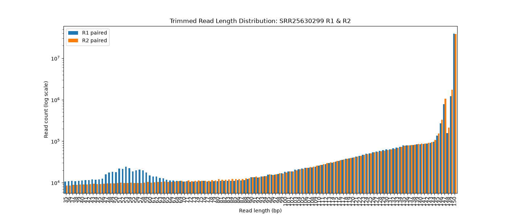
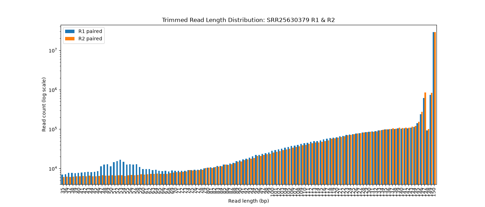

# Lab Notebook — Project 2 

**GOAL:**

*The objectives of this assignment are to use existing tools for quality assessment and adaptor trimming, compare the quality assessments to those from your own software, and to demonstrate your ability to summarize other important information about this RNA-Seq data set in a high-level report.*


**Base Directory**
-
```/projects/bgmp/kymc/bioinfo/Bi623/Proj2_QAA```

**Environment / Versions:**
- Compute environment:

	`Talapas bgmp compute nodes`

- Software/package versions:

```
bash --version	4.4.20
pixi --version	0.72.2
cutadapt --version	5.2
trimmomatic --version	0.41
fastqc --version	0.12.1
STAR --version	2.7.11b
samtools --version	2.5.2
htseq	 2.1.2
pandas	3.0.5
agat	1.7.0

```

**Data Source:**

*DATA:*

The two libraries separately. Library assignments are here: 

```/projects/bgmp/shared/Bi623/QAA_data_assignments.txt```

The demultiplexed, gzipped `.fastq` files are here: 

```/projects/bgmp/shared/2017_sequencing/demultiplexed/```


---
### [08-28-2026]

**Daily Log:**

*Project 2 Part 1*

*Today I ran fasterq and fasterqc on the zipped data files. The output was 4 FASTQC html files that I then viewed and wrote quality assessments for.*

**WORKING DIR:**

```
/projects/bgmp/kymc/bioinfo/Bi623/Proj2_QAA/Project-2-Electric-Organ/Part-1
```

**Evaluation:**

[QC_Eval.md](Part-1/QC_Eval.md)

**Scripts run:**

[faster.sh](Part-1/faster.sh)

**Commands run:**

```
sbatch faster.sh
```
**Job resource usage (`/usr/bin/time -v` summary from Talapas):**

*All SLURM outs*

[slurm-fasterqdump.out](Part-1/slurm-fasterqdump.out)

[slurm-fastqc.out](Part-1/slurm-fastqc.out)

---

### [09-2-2026]

**Daily Log:**

 *Project 2 Part 2*

 *I ran cut adapt on my SRA output files and then I ran trimmomatic on thos output cut adapt files. I then analyzed the data which I have attached below. Ran into issues running trimmomatic and had to unzip the cutadapt output files and not zip the output files from trimmomatic.*

**WORKING DIR:**

```
/projects/bgmp/kymc/bioinfo/Bi623/Proj2_QAA/Project-2-Electric-Organ/Part-2
```

**Evaluation:**

[answers.md](answers.md)

**Scripts run:**

[cutadapt.sh](Part-2/cutadapt.sh)


[trim.sh](Part-2/trim.sh)


[plots.py](Part-2/trimmomatic_outputs/paired_length_dists/plots.py)


**Commands run:**

```
sbatch cutadapt.sh
```

```
sbatch trim.sh
```

```
./plots.py
```

**Plots OUTPUT:**
---


---


---

**Job resource usage (`/usr/bin/time -v` summary from Talapas):**

*CutAdapt SLURM Out:*

[cutadapt_trim_47032187.out](Part-2/cutadapt_trim_47032187.out)

*Trimmomatic SLURM Out:*

[trimmomatic_trim_47034464.out](Part-2/trimmomatic_trim_47034464.out)

---
### [09-03-2026]

**Daily Log:**

*Project 2 Part 3*

*Today I downloaded my data listed below. Then I converted the GFF file to a GTF file using AGAT program. I had to run that twice because the first time it failed due to running out of memory. Next I created a database using the GTF and FASTA data for Campylomormyrus. I got the batch script for STAR from PS8!*

**WORKING DIR:**

```
/projects/bgmp/kymc/bioinfo/Bi623/Proj2_QAA/Project-2-Electric-Organ/Part-3
```

**Data:**

```
/projects/bgmp/shared/Bi623/Project2/campylomormyrus.fasta
```
```
/projects/bgmp/shared/Bi623/Project2/campylomormyrus.gff
```
**AGAT Conversion for GFF file to GTF file:**

*Script:*

[agat.sh](Part-3/agat.sh)

*Command:*

```
agat_convert_sp_gff2gtf.pl --gff campylomormyrus.gff -o campylomormyrus.gtf
```
*SLURM OUT AGAT.SH*

[slurm-agat-conversion.out](Part-3/slurm-agat-conversion.out)

**Making CAMPY Data Base:**

*Script:*

[makedb.sh](Part-3/makedb.sh)

*SLURM OUT MAKEDB.SH:*

[slurm-make-campdb.out](Part-3/slurm-make-campdb.out)

**Aligning the Reads!:**

*Scripts*

[alignS1.sh](Part-3/alignS1.sh)

[alignS2.sh](Part-3/alignS2.sh)

*OUTPUT DATA:*

```
/projects/bgmp/kymc/bioinfo/Bi623/Proj2_QAA/Project-2-Electric-Organ/Part-3/aligned-data
```
**Parsing The SAM Files:**

*Script:*

[parse.py](Part-3/parse.py)

*Files:*

```
/projects/bgmp/kymc/bioinfo/Bi623/Proj2_QAA/Project-2-Electric-Organ/Part-3/aligned-data/campy_SRR299_alignAligned.out.sam
/projects/bgmp/kymc/bioinfo/Bi623/Proj2_QAA/Project-2-Electric-Organ/Part-3/aligned-data/campy_SRR379_alignAligned.out.sam
```
*Counts of Mapped and Unmapped Reads:*

```
#SRR299:

mapped reads:85151282

unmapped reads:4539656

#SRR379:

mapped reads:65648520

unmapped reads:3647454

```
**HTSEQ Counts**

*Scripts:*

[299_htseq.sh](Part-3/299_htseq.sh)
[rv_299_htseq.sh](Part-3/rv_299_htseq.sh)
[379_htseq.sh](Project-2-Electric-Organ/Part-3/379_htseq.sh)
[rv_379_htseq.sh](Part-3/rv_379_htseq.sh)

*Output Path:*

```
/projects/bgmp/kymc/bioinfo/Bi623/Proj2_QAA/Project-2-Electric-Organ/Part-3/htseq
```

*Output Files:*

[htseq_299](Part-3/htseq/htseq_299.txt)
[htseq_299_RV](Part-3/htseq/htseq_379.txt)
[htseq_379](Part-3/htseq/htseq_rv_299.txt)
[htseq_379_RV](Part-3/htseq/htseq_rv_379.txt)

*SLURM OUTPUT:*

[rev 299 slurm](Part-3/slurm-299_rv.out)
[299 slurm](Part-3/slurm-299.out)
[rev 379 slurm](Part-3/slurm-379_rv.out)
[379 slurm](Part-3/slurm-379.out)

**Updated Answers: For Data Analysis**

[answers.md](answers.md)

---